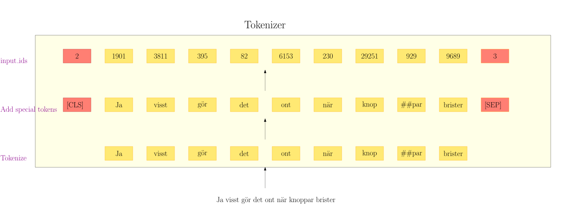

# (PART\*) Overview {-}

# Document Classifiation {#intro}

In text classification we are looking to assign documents to predefined categories. 
We call our input to the model a *text sequence*, where *sequence* can be a text of arbitrary length. 
In many NLP contexts you will encounter the term *sentence* being used interchangeably as a synonym 
for *sequence*. This can be rather confusing for beginners, but has become established since
some early transformer papers took the liberty of loosening the definition of the term *sentence*. 


TODO: Create similar image as above (source d2l.ai)

## Examples of classification tasks

Examples of text classification include any task where we wish to assign 
documents to discrete categories. We list some examples usages:

* **Politics**: Determine the political lean of a text.
* **Sentiment analysis**: Does a text express positive or negative sentiment in contexts where your product/organization is mentioned?
* **Toxicity**: Can we classify toxic or threatening comments posted on our website and automatically flag them for review?
* **E-mails**: Categorizing incoming e-mails and automatically suggesting the correct department in your organization they should be forwarded to. 

## Expected data


```{=html}
<div id="htmlwidget-cf4b33db4702e51c4f6a" class="reactable html-widget" style="width:auto;height:auto;"></div>
<script type="application/json" data-for="htmlwidget-cf4b33db4702e51c4f6a">{"x":{"tag":{"name":"Reactable","attribs":{"data":{"text":["En gång i tiden hade de ett mycket bra kort, ikanokortet. Tyvärr har kortet försämrats oerhört mycket så nu är det totalt ointressant. Banken känns oerhört omodern. Långa väntetider i telefon till kundservice, och när de väl svarar ger de tyvärr inte alls något professionellt intryck. Jag är väldigt glad att jag inte längre är kund hos dem.","App ur funktion, ett antal falsklarm. Får ingen återkoppling vare sig på e-mail eller via telefon trots upprepade försök att maila och ringa. Det bara görs ”ärenden” av våra frågor om vad som är fel. Vi kan inte använda larmet nu då vi inte vet vad som är fel. Så arrogant bemötande!!!","Jag trodde att räntevillkoren på mina tidigare lån var bland marknadens bästa, eftersom jag håller mig uppdaterad, MEN Northmills erbjudande var överlägset, så det är den bästa deal jag har gjort med en bank.","Väldigt hjälpsam kundservis. Bra varor med topp kvalité och snabbservis.","Har försökt bli kund hos dem och hade en fråga innan. Deras kundservice har inte fungerat denna eller förra månaden. Vågar inte bli kund här även om det är billigt","Trevlig kommunikation, snabb och bra service! Rekommenderas!","Wow vilket jobb ni gjort hemma hos oss! Förstår inte hur ni lyckas få saker så otroligt rena! Jag är så glad och tacksam.","Dom påstår att man kan ha kostnadsfri profil. Men när jag sa åt dom att sluta ringa mig hela tiden och sluta försöka sälja på mig dyra abbonemang, då skrev han att han tar bort min profil. Fast jag sa att jag ville ha min kostnadsfria profil kvar. Väldigt oseriöst. Bluff företag.","Inte så bra lim och utlovad tejp var inte med","Klockren snabb och personlig hjälp vid beställning. Rekommenderas verkligen!"],"label":[0,0,1,1,0,1,1,0,0,1]},"columns":[{"accessor":"text","name":"text","type":"character","cell":[{"name":"div","attribs":{"style":{"text-decoration":"underline","text-decoration-style":"dotted","text-decoration-color":"#FF6B00","cursor":"info","white-space":"nowrap","overflow":"hidden","text-overflow":"ellipsis"}},"children":[{"name":"WidgetContainer","attribs":{"key":"adbce2cc59c2892fad21b38376f194cc"},"children":[{"name":"Fragment","attribs":[],"children":[{"name":"span","attribs":{"id":"htmlwidget-386abca07be3ed17f2f6","width":960,"height":500,"className":"tippy html-widget"},"children":[]},{"name":"script","attribs":{"type":"application/json","data-for":"htmlwidget-386abca07be3ed17f2f6"},"children":["{\"x\":{\"opts\":{\"content\":\"En gång i tiden hade de ett mycket bra kort, ikanokortet. Tyvärr har kortet försämrats oerhört mycket så nu är det totalt ointressant. Banken känns oerhört omodern. Långa väntetider i telefon till kundservice, och när de väl svarar ger de tyvärr inte alls något professionellt intryck. Jag är väldigt glad att jag inte längre är kund hos dem.\"},\"text\":\"En gång i tiden hade de ett mycket bra kort, ikanokortet. Tyvärr har kortet försämrats oerhört mycket så nu är det totalt ointressant. Banken känns oerhört omodern. Långa väntetider i telefon till kundservice, och när de väl svarar ger de tyvärr inte alls något professionellt intryck. Jag är väldigt glad att jag inte längre är kund hos dem.\"},\"evals\":[],\"jsHooks\":[]}"]}]}]}]},{"name":"div","attribs":{"style":{"text-decoration":"underline","text-decoration-style":"dotted","text-decoration-color":"#FF6B00","cursor":"info","white-space":"nowrap","overflow":"hidden","text-overflow":"ellipsis"}},"children":[{"name":"WidgetContainer","attribs":{"key":"0187ee6aff70331751bd5a1a6e77c297"},"children":[{"name":"Fragment","attribs":[],"children":[{"name":"span","attribs":{"id":"htmlwidget-61f8268ebb33b299af34","width":960,"height":500,"className":"tippy html-widget"},"children":[]},{"name":"script","attribs":{"type":"application/json","data-for":"htmlwidget-61f8268ebb33b299af34"},"children":["{\"x\":{\"opts\":{\"content\":\"App ur funktion, ett antal falsklarm. Får ingen återkoppling vare sig på e-mail eller via telefon trots upprepade försök att maila och ringa. Det bara görs ”ärenden” av våra frågor om vad som är fel. Vi kan inte använda larmet nu då vi inte vet vad som är fel. Så arrogant bemötande!!!\"},\"text\":\"App ur funktion, ett antal falsklarm. Får ingen återkoppling vare sig på e-mail eller via telefon trots upprepade försök att maila och ringa. Det bara görs ”ärenden” av våra frågor om vad som är fel. Vi kan inte använda larmet nu då vi inte vet vad som är fel. Så arrogant bemötande!!!\"},\"evals\":[],\"jsHooks\":[]}"]}]}]}]},{"name":"div","attribs":{"style":{"text-decoration":"underline","text-decoration-style":"dotted","text-decoration-color":"#FF6B00","cursor":"info","white-space":"nowrap","overflow":"hidden","text-overflow":"ellipsis"}},"children":[{"name":"WidgetContainer","attribs":{"key":"585678e0d1e9e9e004523dd9210cf20c"},"children":[{"name":"Fragment","attribs":[],"children":[{"name":"span","attribs":{"id":"htmlwidget-f85a57a50be21fac65a0","width":960,"height":500,"className":"tippy html-widget"},"children":[]},{"name":"script","attribs":{"type":"application/json","data-for":"htmlwidget-f85a57a50be21fac65a0"},"children":["{\"x\":{\"opts\":{\"content\":\"Jag trodde att räntevillkoren på mina tidigare lån var bland marknadens bästa, eftersom jag håller mig uppdaterad, MEN Northmills erbjudande var överlägset, så det är den bästa deal jag har gjort med en bank.\"},\"text\":\"Jag trodde att räntevillkoren på mina tidigare lån var bland marknadens bästa, eftersom jag håller mig uppdaterad, MEN Northmills erbjudande var överlägset, så det är den bästa deal jag har gjort med en bank.\"},\"evals\":[],\"jsHooks\":[]}"]}]}]}]},{"name":"div","attribs":{"style":{"text-decoration":"underline","text-decoration-style":"dotted","text-decoration-color":"#FF6B00","cursor":"info","white-space":"nowrap","overflow":"hidden","text-overflow":"ellipsis"}},"children":[{"name":"WidgetContainer","attribs":{"key":"b5c91be9b059d59428f8865419316a32"},"children":[{"name":"Fragment","attribs":[],"children":[{"name":"span","attribs":{"id":"htmlwidget-9b4ce3850f244ba85837","width":960,"height":500,"className":"tippy html-widget"},"children":[]},{"name":"script","attribs":{"type":"application/json","data-for":"htmlwidget-9b4ce3850f244ba85837"},"children":["{\"x\":{\"opts\":{\"content\":\"Väldigt hjälpsam kundservis. Bra varor med topp kvalité och snabbservis.\"},\"text\":\"Väldigt hjälpsam kundservis. Bra varor med topp kvalité och snabbservis.\"},\"evals\":[],\"jsHooks\":[]}"]}]}]}]},{"name":"div","attribs":{"style":{"text-decoration":"underline","text-decoration-style":"dotted","text-decoration-color":"#FF6B00","cursor":"info","white-space":"nowrap","overflow":"hidden","text-overflow":"ellipsis"}},"children":[{"name":"WidgetContainer","attribs":{"key":"9d2cc7af5acba1246cc2ad1046f099fb"},"children":[{"name":"Fragment","attribs":[],"children":[{"name":"span","attribs":{"id":"htmlwidget-eb38ba0e02887dd7e495","width":960,"height":500,"className":"tippy html-widget"},"children":[]},{"name":"script","attribs":{"type":"application/json","data-for":"htmlwidget-eb38ba0e02887dd7e495"},"children":["{\"x\":{\"opts\":{\"content\":\"Har försökt bli kund hos dem och hade en fråga innan. Deras kundservice har inte fungerat denna eller förra månaden. Vågar inte bli kund här även om det är billigt\"},\"text\":\"Har försökt bli kund hos dem och hade en fråga innan. Deras kundservice har inte fungerat denna eller förra månaden. Vågar inte bli kund här även om det är billigt\"},\"evals\":[],\"jsHooks\":[]}"]}]}]}]},{"name":"div","attribs":{"style":{"text-decoration":"underline","text-decoration-style":"dotted","text-decoration-color":"#FF6B00","cursor":"info","white-space":"nowrap","overflow":"hidden","text-overflow":"ellipsis"}},"children":[{"name":"WidgetContainer","attribs":{"key":"64864c238ad0fbf1fb008a6df55b14ac"},"children":[{"name":"Fragment","attribs":[],"children":[{"name":"span","attribs":{"id":"htmlwidget-1d2e5a6100e22f7f0a98","width":960,"height":500,"className":"tippy html-widget"},"children":[]},{"name":"script","attribs":{"type":"application/json","data-for":"htmlwidget-1d2e5a6100e22f7f0a98"},"children":["{\"x\":{\"opts\":{\"content\":\"Trevlig kommunikation, snabb och bra service! Rekommenderas!\"},\"text\":\"Trevlig kommunikation, snabb och bra service! Rekommenderas!\"},\"evals\":[],\"jsHooks\":[]}"]}]}]}]},{"name":"div","attribs":{"style":{"text-decoration":"underline","text-decoration-style":"dotted","text-decoration-color":"#FF6B00","cursor":"info","white-space":"nowrap","overflow":"hidden","text-overflow":"ellipsis"}},"children":[{"name":"WidgetContainer","attribs":{"key":"231429d362aa9765ffddb644415c1267"},"children":[{"name":"Fragment","attribs":[],"children":[{"name":"span","attribs":{"id":"htmlwidget-4b185a4b1d95b166d4b2","width":960,"height":500,"className":"tippy html-widget"},"children":[]},{"name":"script","attribs":{"type":"application/json","data-for":"htmlwidget-4b185a4b1d95b166d4b2"},"children":["{\"x\":{\"opts\":{\"content\":\"Wow vilket jobb ni gjort hemma hos oss! Förstår inte hur ni lyckas få saker så otroligt rena! Jag är så glad och tacksam.\"},\"text\":\"Wow vilket jobb ni gjort hemma hos oss! Förstår inte hur ni lyckas få saker så otroligt rena! Jag är så glad och tacksam.\"},\"evals\":[],\"jsHooks\":[]}"]}]}]}]},{"name":"div","attribs":{"style":{"text-decoration":"underline","text-decoration-style":"dotted","text-decoration-color":"#FF6B00","cursor":"info","white-space":"nowrap","overflow":"hidden","text-overflow":"ellipsis"}},"children":[{"name":"WidgetContainer","attribs":{"key":"4d8aaaedf86439c1c6b6c6a895d5327f"},"children":[{"name":"Fragment","attribs":[],"children":[{"name":"span","attribs":{"id":"htmlwidget-bf20e470e2cbb6e78e58","width":960,"height":500,"className":"tippy html-widget"},"children":[]},{"name":"script","attribs":{"type":"application/json","data-for":"htmlwidget-bf20e470e2cbb6e78e58"},"children":["{\"x\":{\"opts\":{\"content\":\"Dom påstår att man kan ha kostnadsfri profil. Men när jag sa åt dom att sluta ringa mig hela tiden och sluta försöka sälja på mig dyra abbonemang, då skrev han att han tar bort min profil. Fast jag sa att jag ville ha min kostnadsfria profil kvar. Väldigt oseriöst. Bluff företag.\"},\"text\":\"Dom påstår att man kan ha kostnadsfri profil. Men när jag sa åt dom att sluta ringa mig hela tiden och sluta försöka sälja på mig dyra abbonemang, då skrev han att han tar bort min profil. Fast jag sa att jag ville ha min kostnadsfria profil kvar. Väldigt oseriöst. Bluff företag.\"},\"evals\":[],\"jsHooks\":[]}"]}]}]}]},{"name":"div","attribs":{"style":{"text-decoration":"underline","text-decoration-style":"dotted","text-decoration-color":"#FF6B00","cursor":"info","white-space":"nowrap","overflow":"hidden","text-overflow":"ellipsis"}},"children":[{"name":"WidgetContainer","attribs":{"key":"433065f0aed7ad6bb721a64a1fc7b050"},"children":[{"name":"Fragment","attribs":[],"children":[{"name":"span","attribs":{"id":"htmlwidget-3a9a02116ecd1602d41f","width":960,"height":500,"className":"tippy html-widget"},"children":[]},{"name":"script","attribs":{"type":"application/json","data-for":"htmlwidget-3a9a02116ecd1602d41f"},"children":["{\"x\":{\"opts\":{\"content\":\"Inte så bra lim och utlovad tejp var inte med\"},\"text\":\"Inte så bra lim och utlovad tejp var inte med\"},\"evals\":[],\"jsHooks\":[]}"]}]}]}]},{"name":"div","attribs":{"style":{"text-decoration":"underline","text-decoration-style":"dotted","text-decoration-color":"#FF6B00","cursor":"info","white-space":"nowrap","overflow":"hidden","text-overflow":"ellipsis"}},"children":[{"name":"WidgetContainer","attribs":{"key":"74fe95608e7a1c250962a3f6c772620a"},"children":[{"name":"Fragment","attribs":[],"children":[{"name":"span","attribs":{"id":"htmlwidget-e2ee915f57f5a0d79ffa","width":960,"height":500,"className":"tippy html-widget"},"children":[]},{"name":"script","attribs":{"type":"application/json","data-for":"htmlwidget-e2ee915f57f5a0d79ffa"},"children":["{\"x\":{\"opts\":{\"content\":\"Klockren snabb och personlig hjälp vid beställning. Rekommenderas verkligen!\"},\"text\":\"Klockren snabb och personlig hjälp vid beställning. Rekommenderas verkligen!\"},\"evals\":[],\"jsHooks\":[]}"]}]}]}]}],"html":true},{"accessor":"label","name":"label","type":"numeric"}],"defaultPageSize":5,"paginationType":"numbers","showPageInfo":true,"minRows":1,"highlight":true,"striped":true,"theme":{"color":"#2f2f2f","borderColor":"#c5c5c5"},"dataKey":"c1475bde01081208f4af31c193603038"},"children":[]},"class":"reactR_markup"},"evals":[],"jsHooks":[]}</script>
```


## Loading the model
In our examples we will be using `BertForSequenceClassification` to load KB's Swedish `BERT` model for classification tasks. 
This will automatically attach a dense classifier head on top of the pre-trained BERT model's attention layers. 


```{.python .fold-show}
import torch
from transformers import BertForSequenceClassification

device = torch.device("cuda") if torch.cuda.is_available() else torch.device("cpu")
model = BertForSequenceClassification.from_pretrained("KB/bert-base-swedish-cased", num_labels=2)
model.to(device)
model.train()
```

:::info
Naming the layer "pooler" is slightly misleading. A pooling layer generally implies calculating a summary statistic across some feature dimension. For example the element wise averaging of multiple stacked token embedding vectors. However, in the `transformers` library

1. The BertPooler only extracts [the first token tensor](https://github.com/huggingface/transformers/blob/v4.17.0/src/transformers/models/bert/modeling_bert.py#L636) (corresponding to **[CLS]**). Thus they are *not* pooling in the traditional expected sense of averaging across several vectors.
2. They apply a dense layer that "projects" the vector to an output of identical size.

Indeed, in the documentation for BertPooler, they themselves put the word *pool* in quotation marks:


```{.python .fold-show}
# We "pool" the model by simply taking the hidden state corresponding
# to the first token.
```
:::

## Loading the tokenizer

<div class="figure">

<p class="caption">(\#fig:tokenizerfig)Our transformer model expects integer inputs. Therefore we tokenize our input text. Each token maps to an integer id in our vocabulary consisting of $\mathbf{50325}$ tokens. With the help of these integer ids, the model can select the correct input token embedding from its 'vocabulary of embeddings' ($\mathbf{50325 \times 768}$).</p>
</div>


